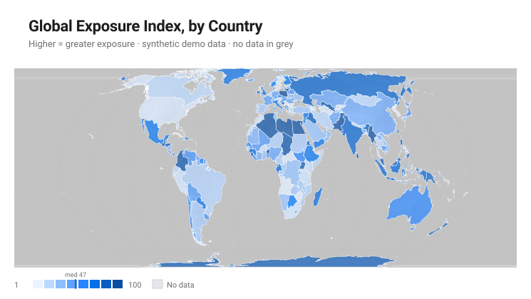

# Examples

Practical, runnable recipes for `sprezzature-maps`. See [`README.md`](README.md)
for install instructions.

This file grows alongside the project's surfaces (library, CLIs, HTTP API,
MCP, GUI) rather than being written once upfront — expect new sections as
those surfaces land. The two example images below are the actual,
regularly-regenerated output of `make_choropleth()`/`make_situation_map()`
with no arguments (`assets/svg-examples/`) — not hand-picked screenshots —
so they can never silently drift from what the code in this repo produces.

### `choropleth`



### `situation_map`


## Python library

```python
from sprezzature_maps import make_choropleth, make_situation_map

# Demo data if none supplied.
make_choropleth(out="world.svg")
print("wrote world.svg")
# wrote world.svg

# Your own per-country data (id = ISO-3166-1 numeric country code).
make_choropleth(
    data=[{"id": "840", "value": 12.5}, {"id": "124", "value": -3.2}],
    title="Something, by country",
    out="custom.svg",
)

# Diverging ramp (negative/neutral/positive) auto-detects when the data
# spans both signs, as in the example above -- force it explicitly with
# diverging=True/False if you want to override the auto-detection.
make_choropleth(data=[...], diverging=True, out="growth.svg")

# The bundled Western-Europe demo config.
make_situation_map(out="region.svg")

# Your own region: a real YAML config (see scripts/make_situation_map.py's
# module docstring for the full schema) loaded and passed as a dict.
import yaml
config = yaml.safe_load(open("my-region.yaml"))
make_situation_map(config=config, out="region.svg")
```

## Command line (`make-map`, argparse — always installed)

```bash
# Demo data, default output path.
make-map choropleth --out world.svg

# Your own data (JSON file: a list of {"id": ..., "value": ...} rows).
make-map choropleth --data my-data.json --out world.svg --title "My indicator"

# A region config.
make-map situation_map --config my-region.yaml --out region.svg
```

## HTTP API (`sprezzature-maps[api]`)

```bash
pip install 'sprezzature-maps[api]'
uvicorn sprezzature_maps.api:app --reload
```

```bash
# Demo choropleth as SVG.
curl -X POST http://localhost:8000/v1/choropleth -o choropleth.svg

# Your own data, as PNG.
curl -X POST http://localhost:8000/v1/choropleth \
  -H "Content-Type: application/json" \
  -d '{"data": [{"id": "840", "value": 12.5}, {"id": "124", "value": -3.2}], "format": "png"}' \
  -o choropleth.png

# Demo situation map.
curl -X POST http://localhost:8000/v1/situation-map -o situation_map.svg

# Discover the two kinds programmatically instead of hardcoding them.
curl http://localhost:8000/v1/kinds
# ["choropleth", "situation_map"]

# Interactive docs (OpenAPI / Swagger UI) and the GUI gallery.
open http://localhost:8000/docs
open http://localhost:8000/
```

## Command line (`sprezzature-maps`, Click — `sprezzature-maps[cli]`)

The richer twin of `make-map`: CSV/TSV/JSONL ingestion (not just a
pre-shaped JSON file) plus `--map role=column` bindings for a file whose
columns aren't already named `id`/`value`.

```bash
pip install 'sprezzature-maps[cli]'

sprezzature-maps list
# choropleth
# situation_map

# A CSV with your own column names, bound explicitly.
sprezzature-maps choropleth \
  --data my-data.csv --map id=CountryCode --map value=Score \
  --out world.svg --title "My indicator"

# Force the diverging ramp off even though the data has both signs.
sprezzature-maps choropleth --data my-data.csv --no-diverging --out world.svg

# Read CSV from stdin.
cat my-data.csv | sprezzature-maps choropleth --data - --out world.svg

sprezzature-maps situation-map --config my-region.yaml --out region.svg
```

## MCP (`sprezzature-maps[api,mcp]`)

Exposes the same HTTP routes as MCP tools (`list_kinds`,
`render_choropleth`, `render_situation_map`) for any MCP-aware agent host.

```bash
pip install 'sprezzature-maps[api,mcp]'
sprezzature-maps-mcp
# MCP endpoint at http://localhost:8000/mcp,
# alongside the regular HTTP routes and the GUI at http://localhost:8000/
```

Point an MCP client's server config at that URL; the tool descriptions
come straight from the FastAPI route docstrings in `sprezzature_maps/api.py`,
so they stay in sync with the HTTP API automatically.
